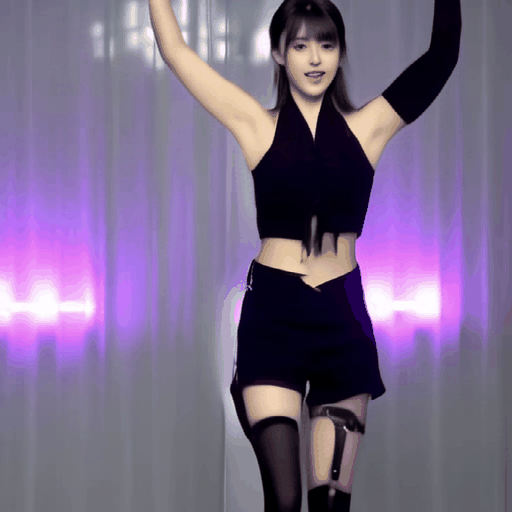

# StableAnimator

<a href='https://francis-rings.github.io/StableAnimator'></a> <a href='https://arxiv.org/abs/2411.17697'></a> <a href='https://huggingface.co/FrancisRing/StableAnimator/tree/main'></a> <a href='https://www.youtube.com/watch?v=7fwFyFDzQgg'></a>

StableAnimator: High-Quality Identity-Preserving Human Image Animation
<br/>
*Shuyuan Tu<sup>1</sup>, Zhen Xing<sup>1</sup>, Xintong Han<sup>3</sup>, Zhi-Qi Cheng<sup>4</sup>, Qi Dai<sup>2</sup>, Chong Luo<sup>2</sup>, Zuxuan Wu<sup>1</sup>*
<br/>
[<sup>1</sup>Fudan University; <sup>2</sup>Microsoft Research Asia; <sup>3</sup>Huya Inc; <sup>4</sup>Carnegie Mellon University]

<p align="center">
  
  
  
  
  
  
  <br/>
  <span>Pose-driven Human image animations generated by StableAnimator, showing its power to synthesize <b>high-fidelity</b> and <b>ID-preserving videos</b>. All animations are <b>directly synthesized by StableAnimator without the use of any face-related post-processing tools</b>, such as the face-swapping tool FaceFusion or face restoration models like GFP-GAN and CodeFormer.</span>
</p>

<p align="center">
  
  
  
  
  <br/>
  <span>Comparison results between StableAnimator and state-of-the-art (SOTA) human image animation models highlight the superior performance of StableAnimator in delivering <b>high-fidelity, identity-preserving human image animation</b>.</span>
</p>


## Overview

<p align="center">
  
  </br>
  <i>The overview of the framework of StableAnimator.</i>
</p>

Current diffusion models for human image animation struggle to ensure identity (ID) consistency. This paper presents StableAnimator, <b>the first end-to-end ID-preserving video diffusion framework, which synthesizes high-quality videos without any post-processing, conditioned on a reference image and a sequence of poses.</b> Building upon a video diffusion model, StableAnimator contains carefully designed modules for both training and inference striving for identity consistency. In particular, StableAnimator begins by computing image and face embeddings with off-the-shelf extractors, respectively and face embeddings are further refined by interacting with image embeddings using a global content-aware Face Encoder. Then, StableAnimator introduces a novel distribution-aware ID Adapter that prevents interference caused by temporal layers while preserving ID via alignment. During inference, we propose a novel Hamilton-Jacobi-Bellman (HJB) equation-based optimization to further enhance the face quality. We demonstrate that solving the HJB equation can be integrated into the diffusion denoising process, and the resulting solution constrains the denoising path and thus benefits ID preservation. Experiments on multiple benchmarks show the effectiveness of StableAnimator both qualitatively and quantitatively.

## News
* `[2024-11-28]`:🔥 The data pre-processing codes (human skeleton extraction) are available! Other codes will be released very soon. Stay tuned!
* `[2024-11-26]`:🔥 The project page, code, technical report and [a basic model checkpoint](https://huggingface.co/FrancisRing/StableAnimator/tree/main) are released. Further training codes, data pre-processing codes, the evaluation dataset and StableAnimator-pro will be released very soon. Stay tuned!

## To-Do List
- [x] StableAnimator-basic 
- [x] Inference Code
- [x] Evaluation Samples
- [x] Data Pre-Processing Code (Skeleton Extraction)
- [ ] Data Pre-Processing Code (Human Face Mask Extraction)
- [ ] Evaluation Dataset
- [ ] Training Code
- [ ] StableAnimator-pro
- [ ] Inference Code with HJB-based Face Optimization

## Quickstart

For the basic version of the model checkpoint, it supports generating videos at a 576x1024 or 512x512 resolution. If you encounter insufficient memory issues, you can appropriately reduce the number of animated frames.

### Environment setup

Recommend python 3+ with torch 2.x are validated with an Nvidia V100 GPU. We recommend you to utilize the docker image [2.1.0-cuda11.8-cudnn8-devel](https://hub.docker.com/layers/pytorch/pytorch/2.1.0-cuda11.8-cudnn8-devel/images/sha256-558b78b9a624969d54af2f13bf03fbad27907dbb6f09973ef4415d6ea24c80d9?context=explore) or [deeptimhe/ubuntu20.04-cuda11.3.1-python3.8-pytorch1.12:orig-sing-pytorch3d0.7.2](https://hub.docker.com/layers/deeptimhe/ubuntu20.04-cuda11.3.1-python3.8-pytorch1.12/orig-sing-pytorch3d0.7.2/images/sha256-023fbbc55df6d9feffc75a3fe2daba31e09ecc39c5dcc39a6cb64e5c6a7f9ca7?context=explore). Follow the commands below to install all the dependencies of StableAnimator:

```
pip install -r requirements.txt
conda install xformers -c xformers -y
pip install onnxruntime-gpu==1.17.0 --index-url=https://pkgs.dev.azure.com/onnxruntime/onnxruntime/_packaging/onnxruntime-cuda-12/pypi/simple
```

### Download weights
If you encounter connection issues with Hugging Face, you can utilize the mirror endpoint by setting the environment variable: `export HF_ENDPOINT=https://hf-mirror.com`.
Please download weights manually as follows:
```
cd StableAnimator/
mkdir checkpoints
```
All the weights should be organized in models as follows
```
checkpoints/
├── DWPose
│   ├── dw-ll_ucoco_384.onnx
│   └── yolox_l.onnx
├──Animation
│   ├── pose_net.pth
│   ├── face_encoder.pth
│   └── unet.pth
├──SVD
│   └── stable-video-diffusion-img2vid-xt
│       ├── feature_extractor
│       ├── image_encoder
│       ├── scheduler
│       ├── unet
│       ├── vae
│       ├── model_index.json
│       ├── svd_xt.safetensors
│       └── svd_xt_image_decoder.safetensors 

```
1. Download DWPose pretrained model: [dwpose](https://huggingface.co/FrancisRing/StableAnimator/tree/main/DWPose)
2. Download the pre-trained checkpoint of StableAnimator from [Huggingface](https://huggingface.co/FrancisRing/StableAnimator/tree/main/Animation)
3. Download the SVD pretrained model: [SVD](https://huggingface.co/stabilityai/stable-video-diffusion-img2vid-xt/tree/main)
4. The weights for the face model (ArcFace) will be automatically downloaded to the './models' when you run the inference command. If the face model weights cannot be downloaded automatically, you can manually download the pretrained weights from [Huggingface](https://huggingface.co/FrancisRing/StableAnimator/tree/main/antelopev2).

The overall file structure of this project should be organized as follows:
```
StableAnimator/
├── DWPose
├── animation
├── checkpoints
│   ├── DWPose
│   │   ├── dw-ll_ucoco_384.onnx
│   │   └── yolox_l.onnx
│   ├── Animation
│   │   ├── pose_net.pth
│   │   ├── face_encoder.pth
│   │   └── unet.pth
│   └── SVD
│       ├── feature_extractor
│       ├── image_encoder
│       ├── scheduler
│       ├── unet
│       ├── vae
│       ├── model_index.json
│       ├── svd_xt.safetensors
│       └── svd_xt_image_decoder.safetensors
├── models
│   └── antelopev2
│       ├── 1k3d68.onnx
│       ├── 2d106det.onnx
│       ├── genderage.onnx
│       ├── glintr100.onnx
│       └── scrfd_10g_bnkps.onnx
├── command_basic_infer.sh
├── inference_basic.py
├── requirement.txt 
```

### Evaluation Samples
The evaluation samples presented in the paper can be downloaded from [OneDrive](https://1drv.ms/f/c/becb962aad1a1f95/EubdzCAI7BFLhJff2LrHkt8BC9mOiwJ5V67t-ypxRnCK4Q?e=ElEmcn). Please download evaluation samples manually as follows:
```
cd StableAnimator/
mkdir inference
```
All the evaluation samples should be organized as follows:
```
inference/
├── case-1
│   ├── poses
│   ├── faces
│   └── reference.png
├── case-2
│   ├── poses
│   ├── faces
│   └── reference.png
├── case-3
│   ├── poses
│   ├── faces
│   └── reference.png
```
It is worth noting that the data pre-processing codes (human face mask extraction) will be released very soon. Stay tuned! 

### Human Skeleton Extraction
We leverage the pre-trained DWPose to extract the human skeletons. In the initialization of DWPose, the pretrained weights should be configured in `/DWPose/dwpose_utils/wholebody.py`:
```
onnx_det = 'path/checkpoints/DWPose/yolox_l.onnx'
onnx_pose = 'path/checkpoints/DWPose/dw-ll_ucoco_384.onnx'
```
Given the target image folder containing multiple .png files, you can use the following command to obtain the corresponding human skeleton images:
```
python skeleton_extraction.py --target_image_folder_path="path/test/target_images" --ref_image_path="path/test/reference.png" --poses_folder_path="path/test/poses"
```
It is worth noting that the .png files in the target image folder are named in the format `frame_i.png`, such as `frame_0.png`, `frame_1.png`, and so on. 
`--ref_image_path` refers to the path of the given reference image. The obtained human skeleton images are saved in `path/test/poses`. It is particularly significant that the target skeleton images should be aligned with the reference image regarding the body shape.

If you only have the target MP4 file (target.mp4), we recommend you to use `ffmpeg` to convert the MP4 file to multiple frames (.png files) without any quality loss.
```
ffmpeg -i target.mp4 -q:v 1 path/test/target_images/frame_%d.png
```
The obtained frames are saved in `path/test/target_images`.

### Model inference

A sample configuration for testing is provided as `command_basic_infer.sh`. You can also easily modify the various configurations according to your needs.

```
bash command_basic_infer.sh
```
StableAnimator supports human image animation at two different resolution settings: 512x512 and 576x1024. You can modify "--width" and "--height" in `command_basic_infer.sh` to set the resolution of the animation. "--output_dir" in `command_basic_infer.sh` refers to the saved path of the generated animation. "--validation_control_folder" and "--validation_image" in `command_basic_infer.sh` refer to the paths of the given pose sequence and the reference image, respectively.
"--pretrained_model_name_or_path" in `command_basic_infer.sh` is the path of pretrained SVD. "posenet_model_name_or_path", "face_encoder_model_name_or_path", and "unet_model_name_or_path" in `command_basic_infer.sh` refer to paths of pretrained StableAnimator weights.
If you have enough GPU resources, you can increase the value (4=>8=>16) of "--decode_chunk_size" in `command_basic_infer.sh` to promote the temporal smoothness of the animation.

Tips: if your GPU memory is limited, you can reduce the number of animated frames. This command will generate two files: <b>animated_images</b> and <b>animated_images.gif</b>.
If you want to obtain the high quality MP4 file, we recommend you to leverage ffmpeg on the <b>animated_images</b> as follows:
```
cd animated_images
ffmpeg -framerate 20 -i frame_%d.png -c:v libx264 -crf 10 -pix_fmt yuv420p /path/animation.mp4
```
"-framerate" refers to the fps setting. "-crf" indicates the quality of the generated MP4 file, with smaller values corresponding to higher quality.

### VRAM requirement and Runtime

For the 15s demo video (fps=30), the 16-frame basic model requires 18GB VRAM and finishes in 12 minutes on a 4090 GPU.

The minimum VRAM requirement for the 16-frame U-Net model is 10GB; however, the VAE decoder demands 16GB. You have the option to run the VAE decoder on CPU.

## Contact
If you have any suggestions or find our work helpful, feel free to contact me

Email: francisshuyuan@gmail.com

If you find our work useful, <b>please consider giving a star to this github repository and citing it</b>:
```bib
@article{tu2024stableanimator,
  title={StableAnimator: High-Quality Identity-Preserving Human Image Animation},
  author={Shuyuan Tu and Zhen Xing and Xintong Han and Zhi-Qi Cheng and Qi Dai and Chong Luo and Zuxuan Wu},
  journal={arXiv preprint arXiv:2411.17697},
  year={2024}
}
```
